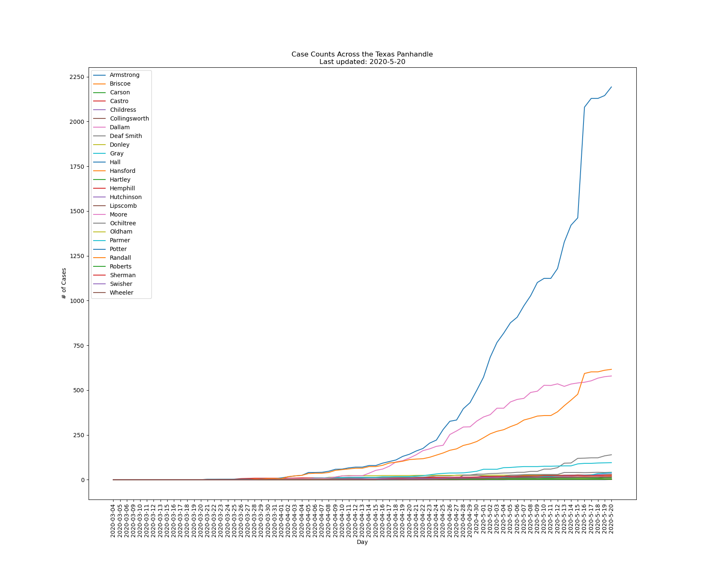

# COVID-19 Texas Panhandle

Graphing mechanisms for COVID-19 in the Texas Panhandle.

## Description

This is for the people of the Texas Panhandle. It simply just graphs the information given by the DSHS. 
Note: Some of the data is calculated and may be calculated incorrectly. If you find conflicting information, please just use the DSHS's data over these graphs.  
*** WORK IN PROGRESS ***

## Dependencies

* [Python 3](https://www.python.org/)
* [cURL](https://curl.haxx.se/download.html)

## Installing

* `git clone https://github.com/davleop/COVID-19-Texas-Panhandle.git`
* `cd COVID-19-Texas-Panhandle`
* `pip install -r requirements.txt`

## Executing program

If using Windows, just use the `run.bat` file.  
If using Linux, use the `run.sh` file.  
Outputs are in the `graphs` and `png` directories.

## Screenshots

You should find all the save images in the `graphs` directory when the program is run.

## Help

You can ping me through [Twitter](https://twitter.com/_D2P2_) if you need help or [Create an Issue](https://github.com/davleop/COVID-19-Texas-Panhandle/issues)

## Author

David Penn  
Twitter: [@\_D2P2\_](https://twitter.com/_D2P2_)

## License

This project is licensed under the Creative Commons Legal Code License - see the LICENSE.md file for details.
